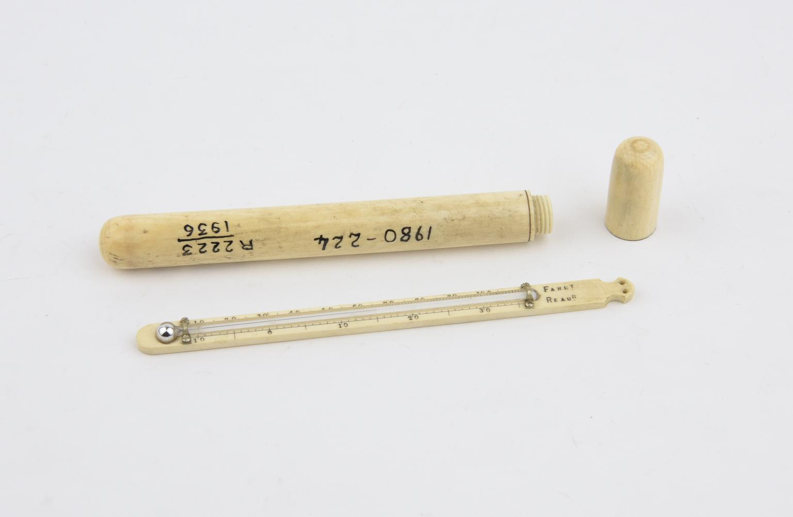

# New Registration System

A new registration system was introduced in 1935 for both new acquisitions and for objects already in the collection. 

This sequence of registration numbers started at R1 each year, followed by the year of registration e.g. R1/1935, R2/1935 etc., then R1/1936, R2/1936, and so forth. 

If objects already had A numbers, or R numbers from the old registration system, these were recorded next to the new registration number in ledger registers \(WA/HMM/CM/Acc/21-56\). There are also index cards for selected R year numbered objects: WA/HMM/CM/Inv/A.240-A.268; A.273. Objects, and batches of objects, continued to be assigned A numbers prior to registration.

On the objects themselves, old numbers were not usually obliterated, but crossed out with a single red line and the new numbers added in white or black ink close by. 

Paintings were also registered in the museum new registration system between 1935 and 1980. Paintings were supposed to be given ‘P’ prefixes in place of ‘R’, although this doesn't seem to have happened consistently.

On index cards and often on objects, new registration numbers are written without the R prefix. New registration numbers are most frequently expressed as a fraction e.g. $$\frac{2223}{1936}$$ or with a forward slash $$2223/1936$$although other notation styles include an apostrophe separator between the two numbers $$2223'1936$$and the abbreviated date format $$2223'36$$. 

In Transcribe Wellcome, new registration numbers are standardised to include the R prefix and the forward slash notation, i.e. R2223/1936.    

