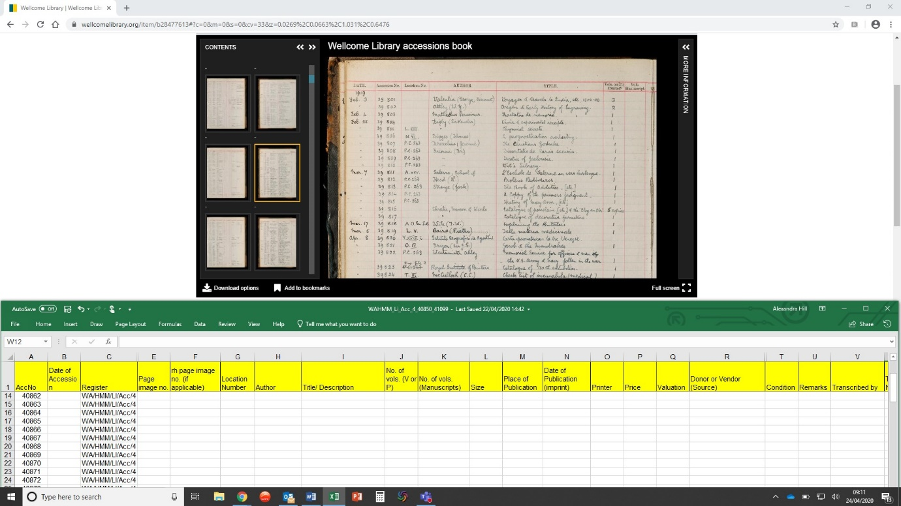

# Getting Started

You can transcribe either directly from the [Wellcome Collection](https://wellcomecollection.org) website or from a downloaded PDF of the digitised images.

Each transcriber will be sent a transcription spreadsheet template and a URL link to a catalogue entry e.g. [https://wellcomecollection.org/works/z5p7gm97](https://wellcomecollection.org/works/z5p7gm97)

Click on the 'View' button on the catalogue entry, and this takes you to a specific set of images: of entries in a register or corresponding to a box of index cards \(known as 'flimsy slips' because they were typically printed on lightweight, ‘flimsy’ paper\). 

If a 'Content Advisory' message pops up, read the message then click 'Show the Content' in order to load the images into your browser.

### Transcribing directly from the Wellcome Collection website

We recommend that if possible you transcribe directly from the Wellcome Collection website, as the images available here are higher quality than those available when you download a PDF. This means that you can expand the image to full screen without loss of resolution using the zoom controls.

**Image Number** If you decide to transcribe directly from the website, the image number is the number at the top middle of the image viewer window to the left of the '/'.

### Transcribing from PDF

You may find it more convenient to transcribe from a PDF, which can be used offline or printed out.

To download a PDF of all the images in a register, box or file:

Click on  then select ‘Whole item PDF’ from the options presented, and save to your computer or other device in the usual way. 

**Important note**: if you choose to transcribe from PDF, _the image number must be transcribed as_ _**the PDF page number minus 1**_, because of the cover sheet added to the PDF.

### Setting up your desktop

If you only have one monitor, it may help to arrange your browser / PDF window and the transcription spreadsheet one on top of the other, so that you can see both the digitised images and several rows in the transcription spreadsheet at the same time:

